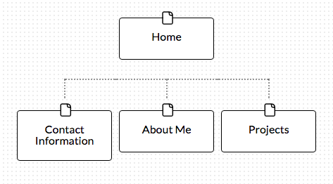

* What are the 6 Phases of Web Design?

    1. Information Gathering
    2. Planning
    3. Design
    4. Development
    5. Testing and Delivery
    6. Maintenance

* What is your site's primary goal or purpose? What kind of content will your site feature?

    I want my website to read like a biography.  The content will feature my experiences, what I’ve learned, and about ongoing projects.

* What is your target audience's interests and how do you see your site addressing them?

    I think my target audience will be those who are going through similar experiences or are in my age bracket (mid-20s).

* What is the primary "action" the user should take when coming to your site? Do you want them to search for information, contact you, or see your portfolio? It's ok to have several actions at once, or different actions for different kinds of visitors.

    They will be mainly reading about my experiences, i.e., I put together a computer and have included pictures, models of the pieces I bought, and resources I used to put it together.

* What are the main things someone should know about design and user experience?

    It’s not enough to just design based on what the client wants for their system but to also incorporate the idea of a pleasant user experience.  With a good design, a user can flow through the website and know where they are.

* What is user experience design and why is it valuable?

    User experience design is when a system (i.e., website, web application, desktop software) is centered around the user, making the system easy to use, efficient, and useful to the user.  It’s valuable because you want your users to have a pleasant experience and come back.  You especially want the system to stand out against others as well.

* Which parts of the challenge did you find tedious?

    Getting set up was the worst part which isn't even that bad to start with.